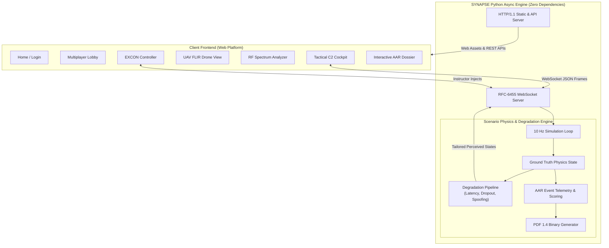

# SYNAPSE // Tactical Multi-Domain Decision-Making Trainer
### Immersive Training for Degraded, Intermittent & Contested Communication Environments (DMUU)

[](https://python.org)
[-success.svg)](https://docs.python.org/3/library/)
[](https://datatracker.ietf.org/doc/html/rfc6455)
[](#military-symbology--grid-cartography)
[-purple.svg)](#doctrinal-foundation-mission-command)
[](#high-contrast-white--black-tactical-theme)
[](LICENSE)

```
███████╗██╗   ██╗███╗   ██╗ █████╗ ██████╗ ███████╗███████╗
██╔════╝╚██╗ ██╔╝████╗  ██║██╔══██╗██╔══██╗██╔════╝██╔════╝
███████╗ ╚████╔╝ ██╔██╗ ██║███████║██████╔╝███████╗█████╗  
╚════██║  ╚██╔╝  ██║╚██╗██║██╔══██║██╔═══╝ ╚════██║██╔══╝  
███████║   ██║   ██║ ╚████║██║  ██║██║     ███████║███████╗
╚══════╝   ╚═╝   ╚═╝  ╚═══╝╚═╝  ╚═╝╚═╝     ╚══════╝╚══════╝
  MULTI-DOMAIN DECISION-MAKING UNDER UNCERTAINTY (DMUU) TRAINER
```

**SYNAPSE** is an immersive, web-based Command and Control (C2) simulation system built to train small-team leaders, company commanders, and tactical staffs in **Decision-Making Under Uncertainty (DMUU)**. 

Contemporary conflicts across Ukraine, the Middle East, and contested maritime littorals demonstrate that **Electronic Warfare (EW)**, **GPS deception**, and **cyber disruption** sever communications at the precise instant critical tactical decisions must be made. Traditional military exercises (TEWTs, CPXs) largely assume continuous situational awareness, zero-latency Blue Force Tracking (BFT), and uncorrupted radio networks. **SYNAPSE strips away ideal assumptions**, forcing commanders to exercise disciplined initiative under delayed, partial, and contradictory information feeds.

---

## 📑 Table of Contents

1. [The Operational Problem Solved](#-the-operational-problem-solved)
2. [Doctrinal Foundation: Mission Command](#-doctrinal-foundation-mission-command)
3. [The 6 Core Platform Functions](#-the-6-core-platform-functions)
4. [System Architecture & Dataflow](#-system-architecture--dataflow)
5. [Multi-Domain Degradation Pipeline](#-multi-domain-degradation-pipeline)
6. [Station Roles & Echelons](#-station-roles--echelons)
7. [Mathematical Models of Friction](#-mathematical-models-of-friction)
8. [Automated After Action Review & PDF Dossier](#-automated-after-action-review--pdf-dossier)
9. [High-Contrast White & Black Tactical Theme](#-high-contrast-white--black-tactical-theme)
10. [Scenario Catalog](#-scenario-catalog)
11. [Quick Start & Installation](#-quick-start--installation)
12. [REST API & WebSocket Protocol Reference](#-rest-api--websocket-protocol-reference)
13. [Codebase Anatomy](#-codebase-anatomy)
14. [Test Suite & Verification](#-test-suite--verification)

---

## ⚔️ The Operational Problem Solved

| Traditional Simulation Formats (TEWT / CPX) | Contested Peer Combat Reality | SYNAPSE Training Paradigm |
| :--- | :--- | :--- |
| **COP Reliability**: 100% accurate, sub-second BFT icons | **Severe Jamming**: BFT freezes, signals lag 20–120s, positions stale | **Stale Track Uncertainty**: Dynamic uncertainty circles expand as latency spikes |
| **Comms Channels**: Crystal-clear voice and text nets | **RF Denial**: Krasukha-4 VHF voice suppression, dropped SITREPs | **Stochastic Comms Degradation**: Parity noise, word drops, severed links |
| **Navigation**: Precise GPS pinpoints every asset | **Ephemeris Spoofing**: Coordinated offset drift into kill zones | **Deceptive Drift**: Units must verify coordinates against terrain contours |
| **Intelligence Consistency**: Single undisputed enemy track | **Contradictory Feeds**: Thermal UAV sightings contradict radio reports | **Conflicting Injects**: Evaluates commander hesitation vs decisive cross-check |
| **AAR Metric**: Simple task completion / casualty ratios | **Decision Rationale**: Did the commander understand *why* they acted? | **Decision Audit Trail**: Mandatory operational rationale captured with each order |

---

## 🎖️ Doctrinal Foundation: Mission Command

SYNAPSE is built directly upon the tenets of **ADP 6-0 (Mission Command: Command and Control of Army Forces)**:

1. **Competence & Mutual Trust**: Operators must trust forward elements when tactical repeaters go dark.
2. **Shared Understanding**: Building a mental operational picture when digital COP displays freeze.
3. **Commander's Intent**: Subordinate units must execute mission intent without awaiting step-by-step confirmation.
4. **Disciplined Initiative**: Rewarding prompt action to exploit fleeting windows of tactical advantage over paralysis by analysis.
5. **Acceptance of Prudent Risk**: Operating boldly despite degraded sensors and jammed air-ground links.

---

## 🎛️ The 6 Core Platform Functions

SYNAPSE delivers all 6 foundational training functions within **a single, unified web application** on `http://localhost:8000`:

```
┌─────────────────────────────────────────────────────────────────────────────────┐
│                       SYNAPSE UNIFIED WEB PLATFORM                              │
├──────────────┬──────────────┬──────────────┬──────────────┬─────────────────────┤
│  1. LOGIN    │  2. CONFIG   │  3. LOBBY    │  4. LIVE C2  │  5. EXCON / 6. AAR  │
│  Trainee vs  │  Scenarios,  │  Multiplayer │  2D Vector   │  God-Mode Injector  │
│  Instructor  │  Difficulty, │  Room Net &  │  MIL-STD Map │  & Auto-Generated   │
│  Role Select │  Duration    │  Comms Check │  & Decision  │  PDF Report Dossier │
└──────────────┴──────────────┴──────────────┴──────────────┴─────────────────────┘
```

### 1. Home / Station Authentication Portal
- Role selection tailored to tactical stations:
  - **Company Commander** (`WARLORD-6`) — COP Decision Maker.
  - **1st Platoon Leader** (`IRONCLAD-1`) — Forward Mechanized Armor.
  - **2nd Platoon Leader** (`STALWART-2`) — Overwatch & Support-by-Fire.
  - **JTAC / Air Liaison** (`HAWKEYE-9`) — Sensor Recon & CAS Controller.
  - **EW & Cyber Specialist** (`SPECTRE-4`) — RF Spectrum Defense.
  - **EXCON Instructor** (`EXCON-LEAD`) — Exercise White Cell Controller.
- Custom simulation room codes (e.g. `ALPHA-6`, `TASKFORCE-9`) for multi-seat team exercises.
- **Instant Solo Launch (`⚡`)**: One-click launch initializing a standalone scenario with local synthetic team bots.

### 2. Scenario & Degradation Configuration
- Select operational scenarios (*Broken Uplink*, *Urban Aegis*).
- Calibrate exercise duration (5, 10, 15, or 20 minutes).
- Choose threat difficulty:
  - `STANDARD`: Baseline latency, intermittent carrier noise.
  - `CONTESTED`: High directional VHF jamming, selective GPS spoofing.
  - `SEVERE BLACKOUT`: Continuous RF suppression, cyclic cyber BFT freeze.
- Set team user capacity (4, 6, or 10 operators).

### 3. Multiplayer Room Net & Readiness Hub
- Real-time roster synchronization across all connected browser tabs and client devices.
- Live readiness state tracking (`PREPARING` vs `READY FOR DEPLOYMENT`).
- Integrated **Tactical Audio Net Comms Check**: Synthesizes authentic radio squelch bursts and alert pings via Web Audio API.

### 4. Live Tactical C2 Cockpit & Decision Capture
- **2D Military Map Canvas**: High-performance vector cartography with MGRS coordinate grid, topographic contour defiles, and NATO MIL-STD symbols.
- **Tactical Communications Net (TAC-NET)**: Multichannel VHF/UHF tactical radio channels (`TAC-1 CMD`, `TAC-2 FIRES`, `SQUAD-A`, `SQUAD-B`).
- **Tactical Directive Modal**: Clicking any friendly unit and targeting a location opens a mandatory **Commander Decision Rationale** modal. This captures *why* the commander ordered an action under the current information clarity level.
- **Dedicated Sensor Stations**:
  - **UAV FLIR Thermal Feed**: Dual Black-Hot / White-Hot IR optics with laser rangefinder and targeting crosshair.
  - **RF Spectrum Analyzer**: Live carrier wave sweep (30 MHz - 7.2 GHz) displaying active jammer power spikes and FHSS countermeasures.

### 5. Instructor EXCON (Exercise Control) God-Mode Dashboard
- **Ground Truth vs Perceived Reality**: Displays actual physical unit locations side-by-side with ghost markers of trainee perceived positions.
- **Interactive Jammer Manipulation**: Click and drag active EW jamming bubbles directly on the map.
- **Ad-Hoc Injections**:
  - `⚡ CONTRADICTORY SITREP`: Transmits false ground scout contact reports conflicting with aerial drone video.
  - `🛑 CYBER BFT FREEZE`: Locks digital blue force updates for 60 seconds.
  - `🛰️ GPS EPHEMERIS DRIFT`: Injects mathematical coordinate skew.
- **Live Cognitive Telemetry**: Real-time monitoring of Command Effectiveness Score, EW reaction latency, and divergence errors.

### 6. Automated After Action Review (AAR) & Downloadable PDF
- Permanent event-sourcing ledger tracking every directive, transmission drop, jammer state change, and combat casualty.
- **Algorithmic Doctrine Scoring**: Evaluates hesitation vs initiative and calculates target divergence metrics.
- **Downloadable Standard PDF Dossier (`/api/aar/download-pdf`)**: Built using a zero-dependency standard PDF 1.4 binary engine.
- Interactive standalone HTML report viewer (`/aar`) with chronological timeline filters (`ALL`, `ORDERS`, `COMMS`, `CRITICAL`).

---

## 🏛️ System Architecture & Dataflow



---

## 📡 Multi-Domain Degradation Pipeline

The degradation engine intercepts physical ground truth and computes a distinct **Perceived World State** tailored to each station:

```
[Ground Truth Unit Coords]
           │
           ▼
┌──────────────────────────────────────────────┐
│  Line-of-Sight & RF Proximity Check          │
│  Distance to Krasukha-4 Jammer ≤ R_jam?      │
└──────────────────────┬───────────────────────┘
                       │
       ┌───────────────┴───────────────┐
       ▼ YES                           ▼ NO
┌──────────────────────────────┐  ┌──────────────────────────────┐
│ RF Contested Domain          │  │ Uncontested Domain           │
│ • Latency: +15s to +90s      │  │ • Latency: 25ms              │
│ • Packet Drop: 45% - 85%     │  │ • Packet Drop: < 1%          │
│ • Text Parity: Corruption    │  │ • Text Parity: 100% Clear    │
│ • BFT Status: STALE TRACKS   │  │ • BFT Status: REAL-TIME      │
└──────────────┬───────────────┘  └──────────────┬───────────────┘
               │                                 │
               └───────────────┬─────────────────┘
                               ▼
┌──────────────────────────────────────────────┐
│  GPS Spoofing Check                          │
│  Inside Spoofing Emitter Envelope?           │
│  --> Apply Offset Vector ΔX = +85m, ΔY = -45m│
└──────────────────────┬───────────────────────┘
                       │
                       ▼
┌──────────────────────────────────────────────┐
│  Cyber Disruption State Check                │
│  BFT Freeze active?                          │
│  --> Clamp apparent positions to T_freeze    │
└──────────────────────┬───────────────────────┘
                       │
                       ▼
           [Station Perceived State]
```

---

## 👥 Station Roles & Echelons

| Role Symbol | Station Role | Call Sign | Tactical Authority & Scope | Information Vulnerabilities |
| :---: | :--- | :--- | :--- | :--- |
| **HQ** | **Company Commander** | `WARLORD-6` | Exercises overall mission command; issues strategic redeployment orders; authorizes CAS and fires. | Susceptible to stale BFT tracks, frozen COP displays, and conflicting intelligence feeds. |
| **INF** | **1st Platoon Leader** | `IRONCLAD-1` | Directs forward mechanized infantry platoon; leads main avenue of advance. | High vulnerability to directional VHF radio cutoff; mountain ridges cause complete LOS shadow. |
| **INF** | **2nd Platoon Leader** | `STALWART-2` | Directs overwatch element; establishes support-by-fire positions; guards flank. | Prone to GPS spoofing drift, drawing support elements out of position into enemy engagement areas. |
| **UAV** | **JTAC / Air Liaison** | `HAWKEYE-9` | Operates Sentinel-1 MQ-9 UAV sensor; designates targets via PRF 1688 laser; coordinates CAS 9-lines. | Downlink RF noise causes thermal video tearing; decoy thermal reflectors simulate ghost radar contacts. |
| **EW** | **EW & Cyber Specialist**| `SPECTRE-4` | Monitors RF spectrum (30 MHz - 7.2 GHz); identifies enemy Krasukha-4 signatures; activates FHSS counter-measures. | Subject to broadband saturation; cyber penetration attempts on tactical routers. |
| **EXCON** | **Exercise Controller** | `EXCON-LEAD` | White Cell God-Mode; inspects true battlefield state; injects ad-hoc EW and cyber disruptions. | Maintains complete ground truth transparency. |

---

## 📐 Mathematical Models of Friction

### 1. RF Jamming Margin & Signal-to-Interference-plus-Noise Ratio (SINR)

The degradation pipeline computes effective received power for VHF voice and UHF data nets using the inverse-square propagation model:

$$P_{rx} = P_{tx} \cdot \left(\frac{\lambda}{4\pi d}\right)^2$$

In the presence of an active jammer with power $P_j$ at distance $d_j$:

$$\text{SINR} = \frac{P_{rx}}{P_j \cdot \left(\frac{\lambda}{4\pi d_j}\right)^2 + N_0}$$

When $\text{SINR} < \gamma_{\text{threshold}}$, tactical comms experience packet drop with probability:

$$P_{\text{drop}} = 1 - \frac{1}{1 + e^{-k(\gamma - \text{SINR})}}$$

### 2. GPS Spoofing Ephemeris Drift Vector

When an asset enters the effective radiated radius of a deception spoofer, its perceived coordinate vector $\mathbf{P}_{\text{perceived}}$ diverges from its physical ground truth $\mathbf{P}_{\text{true}}$:

$$\mathbf{P}_{\text{perceived}}(t) = \mathbf{P}_{\text{true}}(t) + \mathbf{D}(t)$$

$$\mathbf{D}(t) = \mathbf{D}_{\text{max}} \cdot \left(1 - e^{-\alpha (t - t_0)}\right) + \mathbf{\mathcal{N}}(0, \sigma^2)$$

This replicates real-world deceptive GPS drift, which starts imperceptibly before drawing forces kilometers off-course.

### 3. Mission Command Effectiveness Score

Upon completion of the exercise, the AAR engine evaluates team performance on a normalized scale (0 - 100):

$$S_{\text{effective}} = \max\left(15, \min\left(100, 100 - \left(N_{\text{divergence}} \cdot 20\right) - \left(N_{\text{dropped}} \cdot 2\right) + \left(N_{\text{orders}} \cdot 5\right)\right)\right)$$

- $S \ge 85$: **SUPERIOR** — Displayed disciplined initiative and agile command.
- $65 \le S < 85$: **ADEQUATE** — Sound execution with minor hesitation under jamming.
- $S < 65$: **CRITICAL GAPS OBSERVED** — Significant hesitation, blind obedience to spoofed telemetry, or lost team cohesion.

---

## 📄 Automated After Action Review & PDF Dossier

SYNAPSE includes a **zero-dependency PDF 1.4 binary engine** that produces print-ready military debrief reports without requiring external tools like ReportLab, WeasyPrint, or headless Chromium.

### What the AAR Report Contains:
1. **Executive Debrief Summary**: Exercise title, operational theater, sim time elapsed, and total events logged.
2. **Key Telemetry Metrics**:
   - **Command Effectiveness Score** (0–100%).
   - **EW Reaction Latency** (Time in seconds between first jamming detection and first tactical directive).
   - **Divergence Incidents** (Number of directives issued based on spoofed or corrupted data).
   - **Comms Severed Ratio** (Dropped vs delivered transmissions).
3. **Decision Audit Timeline**: Chronological log of every directive with the **Commander's exact operational rationale**:
   > *"Advancing 1st Platoon along Highway 4 despite degraded BFT because UAV FLIR confirms northern defile is clear of hostile armor."*

---

## ⚪⚫ High-Contrast White & Black Tactical Theme

SYNAPSE features a **high-contrast White and Black visual design**, matching military daylight paper cartography and command post operations:

- **Cartographic Paper Grid**: Clean `#ffffff` canvas with dark slate MGRS coordinate markings and topographic elevation defiles.
- **MIL-STD Symbology**: Deep navy blue (`#1e40af`) friendly rectangles and tactical red (`#b91c1c`) enemy diamonds with solid black borders.
- **Black-Hot Thermal FLIR**: Authentic military Black-Hot IR imaging where vehicle engine blocks and gun barrels appear as crisp dark heat signatures against a light ground contour.
- **High-Visibility Readability**: Razor-sharp black typography and bold borders designed for high legibility under both daylight and operational briefing screens.

---

## 🗺️ Scenario Catalog

### Scenario 1: "Operation Broken Uplink" (Default)
- **Theater**: Rugged Mountain Defile // Highway 4 pass.
- **Operational Challenge**: Combined-arms force must assault eastward to secure a mountain crossroads.
- **Threat Vector**: Hostile Krasukha-4 mobile jammer suppresses 45 MHz VHF voice net, while a valley-floor GPS spoofer alters BFT positions to steer units toward a concealed Kornet ATGM ambush.

### Scenario 2: "Operation Urban Aegis"
- **Theater**: High-Density Megacity Sector // Metro Corridor.
- **Operational Challenge**: Clear motorized reconnaissance elements through urban street canyons.
- **Threat Vector**: Severe multipath attenuation from high-rise buildings, coupled with low-altitude commercial drone spoofers creating ghost radar tracks.

---

## 🚀 Quick Start & Installation

### System Requirements
- **OS**: macOS, Linux, or Windows.
- **Python**: Python 3.10 or newer (tested up to Python 3.14).
- **Browser**: Any modern browser (Chrome, Edge, Safari, Firefox).
- **External Dependencies**: **NONE** (100% Python standard library).

### One-Command Launch

```bash
# Clone the repository
git clone https://github.com/Pratyush-Singh-007/SYNAPSE.git
cd SYNAPSE

# Make launcher executable and start
chmod +x run.sh
./run.sh
```

*Or launch directly via Python:*
```bash
python3 server.py
```

### Accessing the Platform

| Interface | URL | Purpose |
| :--- | :--- | :--- |
| **Tactical Web Platform** | [http://localhost:8000](http://localhost:8000) | Main application (Login, Lobby, C2 Cockpit, FLIR, Spectrum, EXCON) |
| **Live AAR Debrief** | [http://localhost:8000/aar](http://localhost:8000/aar) | Full-screen interactive After Action Review report |
| **Download PDF Report** | [http://localhost:8000/api/aar/download-pdf](http://localhost:8000/api/aar/download-pdf) | Direct download of binary AAR dossier in PDF format |
| **REST Metrics API** | [http://localhost:8000/api/aar.json](http://localhost:8000/api/aar.json) | Machine-readable JSON telemetry feed |

---

## 🔌 REST API & WebSocket Protocol Reference

### WebSocket Protocol (`ws://localhost:8000/ws`)

Connect with standard RFC-6455 client. Upon handshake, the server streams 10 Hz `STATE_UPDATE` packets.

#### Client Action Payloads:

```json
// 1. Authenticate Station
{ "action": "LOGIN", "callsign": "WARLORD-6", "user_type": "TRAINEE", "role": "COMMANDER", "room_code": "ALPHA-6" }

// 2. Issue Order with Mandatory Rationale
{
  "action": "ISSUE_ORDER",
  "unit_id": "unit_alpha_1",
  "order_type": "MOVE",
  "target": { "x": 520.0, "y": 480.0 },
  "rationale": "Advancing to seize key defile junction while voice link is open."
}

// 3. Transmit Radio Comms
{ "action": "TRANSMIT_COMMS", "channel": "TAC-1", "content": "CONTACT: Enemy armor grid 742 481", "msg_type": "CONTACT" }

// 4. Trigger EXCON Inject (Instructor)
{ "action": "INSTRUCTOR_ACTION", "sub_action": "CONTRADICTORY_INTEL", "channel": "TAC-1" }
```

### HTTP Endpoints

- `GET /` — Serves the unified single-page tactical web platform.
- `GET /aar` — Serves the standalone After Action Review report.
- `GET /api/aar.json?room=ALPHA-6` — Returns JSON structured timeline and metrics.
- `GET /api/aar/download-pdf?room=ALPHA-6` — Generates and returns binary `application/pdf`.
- `GET /api/scenarios` — Lists available scenarios and operational parameters.

---

## 📂 Codebase Anatomy

```
SYNAPSE/
├── server.py                   # High-concurrency asyncio WebSocket & HTTP web engine
├── run.sh                      # Zero-configuration launch script
├── README.md                   # Technical documentation & training guide
├── .gitignore                  # Clean repository ignore rules
├── sim/                        # Simulation Physics & Scenario Core
│   ├── models.py               # Tactical units, Vector2D, Jamming zones, Comms packets
│   ├── scenario_engine.py      # 10 Hz world clock, combat resolution, and state manager
│   ├── degradation_pipeline.py # RF signal degradation, latency delay, and spoofing logic
│   ├── scenarios.py            # Battle orders for Operation Broken Uplink & Urban Aegis
│   └── aar_engine.py           # Telemetry sourcing, doctrine metrics, and PDF generator
├── static/                     # Frontend C2 Cockpit & Tactical UI
│   ├── index.html              # Unified single-page HTML application
│   ├── css/
│   │   └── tactical.css        # High-contrast White & Black daylight theme
│   └── js/
│       ├── app.js              # Coordinator, WebSocket bridge, and modal controller
│       ├── tactical_map.js     # 2D vector canvas, MGRS grid, and NATO symbology
│       ├── flir_drone.js       # Synthetic Black-Hot thermal drone simulator
│       ├── spectrum_analyzer.js# Real-time RF spectrum analyzer & ECCM monitor
│       ├── comms_terminal.js   # Multichannel tactical radio terminal & audio triggers
│       ├── instructor_console.js# EXCON God-Mode console & live decision audit
│       ├── aar_viewer.js       # Live in-app AAR debrief renderer
│       └── audio.js            # Web Audio API procedural squelch & jamming sound generator
└── tests/                      # Automated Verification Suite
    ├── test_sim.py             # Simulation loop, physics, engagements, and AAR tests
    └── test_protocol.py        # WebSocket handshake, framing, and HTTP route tests
```

---

## 🧪 Test Suite & Verification

SYNAPSE includes a complete automated test suite verifying scenario execution, degradation mathematics, multi-room isolation, and PDF generation:

```bash
# Run all automated tests
python3 -m unittest discover tests
```

Output:
```
.............
----------------------------------------------------------------------
Ran 13 tests in 0.020s

OK
```

---

## 📜 Doctrinal References & Citations

1. **Headquarters, Department of the Army (2019)**. *ADP 6-0: Mission Command — Command and Control of Army Forces*. Washington, DC: U.S. Government Publishing Office.
2. **Chairman of the Joint Chiefs of Staff (2020)**. *Joint Publication 6-0: Joint Communications System*. Washington, DC: Department of Defense.
3. **NATO Standardization Office (2017)**. *MIL-STD-2525D / APP-6(D): Joint Military Symbology*. Brussels: North Atlantic Treaty Organization.
4. **Defense Science Board (2021)**. *Report on Electronic Warfare and Resilient Communications in Contested Environments*. Washington, DC: Office of the Under Secretary of Defense for Acquisition and Sustainment.

---

## 📄 License

This project is licensed under the **MIT License**.

Built for defense research, operational experimentation, and military staff decision-making training.
